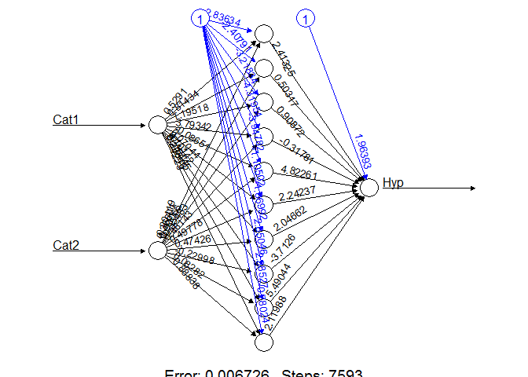
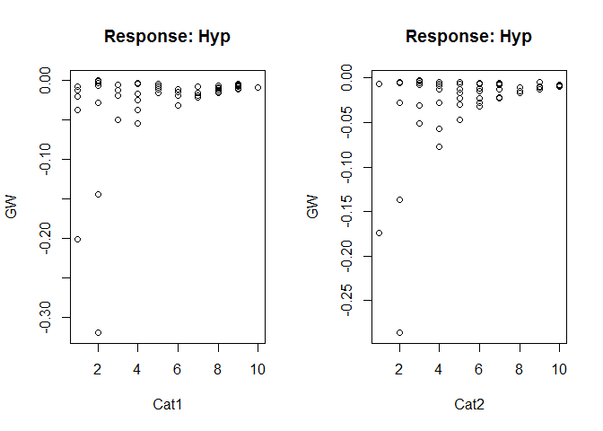
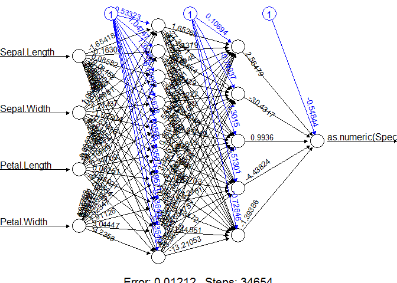
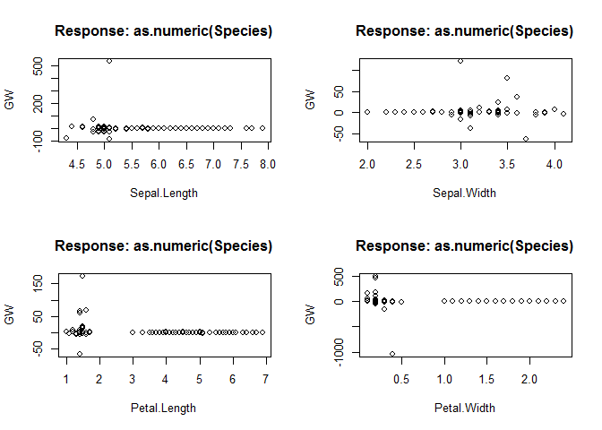

# Redes neuronales con R
Francisco Charte Ojeda  
13 de noviembre de 2015  

> Este es un tutorial muy básico sobre redes neuronales y R, sin asumir ningún conocimiento previo del tema salvo que se tiene R instalado en el sistema y se sabe acceder a su consola para ejecutar órdenes.

Los lenguajes de programación, hojas de cálculo, bases de datos y otras aplicaciones software incorporan funciones predefinidas que nos permiten calcular rápidamente la raíz cuadradada de un número, el seno de un ángulo, logaritmos, la media de un conjunto de valores, etc. Todas estas son operaciones cuya formulación matemática se conoce, por lo que es posible implementarlas de manera relativamente sencilla e invocarlas cuando se necesitan. Una vez programadas, cada función será capaz de realizar exclusivamente la operación enconmendada. Es como si contásemos con una calculadora con esa operación, produciendo siempre la misma salida a partir de las mismas entradas.

Una [red neuronal artificial](https://es.wikipedia.org/wiki/Red_neuronal_artificial) (ANN, *Artificial Neural Network*), asumiendo que tenga la estructura adecuada y cuente con un algoritmo de aprendizaje correcto, es capaz de aprender a realizar teóricamente cualquier operación, sin necesidad de que le facilitemos su formulación matemática. Solo necesita que le facilitemos varios ejemplos de la salida que se produce a partir de ciertas entradas. Si los ejemplos son suficientes y representativos del problema, tras el aprendizaje la red neuronal será capaz de efectuar dicha operación con una alta precisión.

Cabe preguntarse la razón por la cual querríamos usar una ANN en lugar de una función capaz de efectuar la operación con total acierto. Esto último, sin embargo, solo es posible si conocemos la formulación del problema y, además, somos capaces de trasladarlo a un lenguaje para implementarla en software. Hay muchas situaciones en las que se conocen las salidas que producen unas ciertas entradas, pero la función que se aplica a estas últimas para generar las primeras es desconocida o bien resulta muy compleja de calcular. Es en estas situaciones en las que una ANN (u otro modelo de minería de datos, pero aquí nos centramos en las ANN) son considerablemente útiles.

# Una red neuronal que calcula hipotenusas

Comprobemos en la práctica la anterior aseveración de que una ANN puede aprender por sí misma virtualmente cualquier función. El objetivo es obtener una ANN capaz de calcular la hipotenusa a partir de las medidas de lo catetos, pero sin facilitarle la fórmula exacta para hacerlo. Para ello nos serviremos del paquete `neuralnet` de R.

El primer paso es cargar el paquete, introduciendo en la consola de R el siguiente comando:


```r
library(neuralnet)
```

Si la respuesta fuese que el paquete no está disponible, tendremos que instalarlo con el comando `install.packages('neuralnet')`, tras lo cual volveríamos a ejecutar el la orden anterior.

Este paquete de R cuenta con una función, llamada `neuralnet()`, que a partir de una serie de ejemplos se encarga de conducir el aprendizaje de la ANN, devolviendo esta como resultado. A partir de ahí es posible facilitarle solo los datos de entrada para obtener la salida correspondiente.

## Datos de ejemplo

Lo primero que necesitamos son algunos datos de ejemplo que permitan a la ANN aprender la función. Para ello vamos a preparar un `data.frame` (un tipo de dato de R similar a una matriz) con 100 filas, un centenar de ejemplos, cada una de las cuales tendrá tres columnas. Las dos primeras contendrán las medidas de dos catetos y las obtendremos así:


```r
set.seed(42)  # Establece la semilla aleatoria para asegurar reproducibilidad

data <- data.frame(
  Cat1 = round(runif(100, min = 1, max = 10)), 
  Cat2 = round(runif(100, min = 1, max = 10)))

head(data)
```

```
##   Cat1 Cat2
## 1    9    7
## 2    9    3
## 3    4    3
## 4    8    5
## 5    7    9
## 6    6   10
```

La función `runif()` devuelve valores de una distribución uniforme. En este caso concreto le solicitamos 100 valores entre 1 y 10 para cada uno de los catetos. Podemos comprobar cuál es el contenido  del `data.frame` simplemente escribiendo en la consola `data` y pulsando Intro. Esto mostraría las 100 filas. Para comprobar la estructura es suficiente con algunas de ellas, devueltas por la función `head()`.

El `data.frame` debe tener una columna adicional con la hipotenusa correspondiente a cada pareja de catetos. La añadimos de la siguiente manera:


```r
data$Hyp <- sqrt(data$Cat1*data$Cat1 + data$Cat2*data$Cat2)

head(data)
```

```
##   Cat1 Cat2       Hyp
## 1    9    7 11.401754
## 2    9    3  9.486833
## 3    4    3  5.000000
## 4    8    5  9.433981
## 5    7    9 11.401754
## 6    6   10 11.661904
```

## Particiones de entrenamiento y validación

De los 100 ejemplos que contiene nuestro `data.frame` vamos a usar una parte para que la ANN aprenda (partición de entrenamiento o *training*) y otra para comprobar lo bien que ha aprendido (partición de validación o *test*). Lo habitual, cuando no se va a efectuar validación cruzada (varias repeticiones del experimento con distintas particiones de datos), es tomar dos tercios para entrenamiento y el tercio restante para validación. También es habitual seleccionar los ejemplos de forma aleatoria.

Mediante la función `sample()` vamos a tomar aleatoriamente un tercio de los índices correspondientes a las filas (ejemplos) existentes en el `data.frame`. El número de filas se obtiene con la función `nrow()`. Lo que obtenemos como resultado, según puede apreciarse a continuación, es un vector con índices aleatorios, no los datos en sí:

```r
fold.test <- sample(nrow(data), nrow(data) / 3)
fold.test
```

```
##  [1] 89 52 84 43 16 97 91 46 24 92 49 58 30  6 39 72 90 88 45 73 40 14 95
## [24] 75 94 62 23 79  4 18 25 11 21
```

Esos índices, un tercio del total, serán los correspondientes a los ejemplos que usaremos para validación. Cuando se trabaja con un `data.frame` es posible acceder a cualquier dato individual mediante la notación `variable[nfila, ncolumna]`. También es posible obtener múltiples datos simultáneamente, usando como índices vectores de números. Si el número de fila o columna es omitido se asume que se tomarán todas las filas o todas las columnas, según el caso.

Para crear nuestra partición de entrenamiento y de validación usaremos los índices anteriores, almacenados en la variable `fold.test`, para seleccionar las filas adecuadas del `data.frame`:


```r
test  <- data[fold.test, ]
train <- data[-fold.test, ]

head(test)
```

```
##    Cat1 Cat2       Hyp
## 92    2    2  2.828427
## 93    2    6  6.324555
## 29    7    8 10.630146
## 81    8    4  8.944272
## 62    5    6  7.810250
## 50    9    1  9.055385
```

```r
head(train)
```

```
##   Cat1 Cat2       Hyp
## 1    6    4  7.211103
## 2    6    6  8.485281
## 3    8    7 10.630146
## 4    8    4  8.944272
## 5    7    7  9.899495
## 6    8    3  8.544004
```

Con la expresión `data[fold.test, ]` estamos tomando del `data.frame` original las tres columnas de las filas cuyos índices contiene `fold.test`. La expresión `data[-fold.test, ]` es similar, pero tomando las filas cuyos índices no están en el vector `fold.test`. De esta forma obtenemos dos conjuntos disjuntos de ejemplos, uno en la variable `train` y otro en la variable `test`. Ambas son objetos `data.frame`, con las mismas tres columnas que `data`.

## Entrenamiento de la red neuronal
Teniendo preparados los datos que actuarán como ejemplos de la función a aprender, estamos en disposición de entrenar nuestra red neuronal. Para ello no hay más que invocar a la función `neuralnet()` mencionada anteriormente. Esta puede tomar un conjunto bastante importante de parámetros, algunos de ellos relativamente complejos, pero la mayor parte toman valores por defecto adecuados, por lo que en la práctica bastará con una llamada como la siguiente:


```r
ann <- neuralnet(Hyp ~ Cat1 + Cat2, train, hidden = 10, rep = 3)
```

Los dos primeros parámetros son obligatorios. El primero es una fórmula mediante la que se indica qué variables son predictoras (los catetos) y qué variables se van a predecir (la hipotenusa). La sintaxis es simple: disponemos los nombres de las columnas del `data.frame` que contienen datos a obtener como resultado de la red neuronal, en este caso es solo una, separados entre sí mediante el operador `+`. A continuación, tras el símbolo `~`, se facilitan las variables de entrada de la misma manera. El segundo parámetro es el `data.frame` que contiene las variables a las que se hace referencia en la anterior fórmula.

El parámetro `hidden` es opcional. Con él indicamos el número de neuronas que existirá en cada una de las capas ocultas de la ANN. En este caso vamos a tener una sola capa oculta con 10 neuronas. Por defecto la función `neuralnet()` efectúa una sola vez el proceso de entrenamiento de la ANN. Con el parámetro `rep` se cambia el número de repeticiones (en el proceso hay una componente aleatoria que provoca que cada red obtenida tras el entrenamiento sea distinta), con el objetivo de obtener la mejor ANN posible.

Finalizado el proceso de aprendizaje, la estructura de las distintas ANN obtenidas queda almacenada en la variable `ann`. Podemos imprimirla para obtener un resumen del rendimiento de las ANN:

```r
ann
```

```
## Call: neuralnet(formula = Hyp ~ Cat1 + Cat2, data = train, hidden = 10,     rep = 3)
## 
## 3 repetitions were calculated.
## 
##         Error Reached Threshold Steps
## 1 0.006725962       0.009883311  7593
## 3 0.012119691       0.009604500  8799
## 2 0.028969166       0.009210339 28154
```

Por cada repetición se indica el error cometido, el umbral alcanzado y el número de pasos que ha demandado el aprendizaje. El número de pasos, también conocido como *épocas*, puede limitarse o ampliarse, lo cual afectará a la precisión de la ANN. Durante el proceso de aprendizaje se usa un algoritmo que determina, para las entradas facilitadas, el error que ha cometido la ANN en su salida. En función de la magnitud de ese error se ajustarán los pesos asociados a las conexiones entre las neuronas de las distintas capas. Esto provoca que para unos valores de entrada se genere una cierta salida que en el futuro, tras efectuar cambios en dichos pesos como resultado del procesamiento de otros ejemplos, será distinta. Para estabilizar la red se procesan los mismos ejemplos de manera reiterada y en distinto orden, hasta que se converge a un cierto umbral de mejora o se alcanza un máximo de pasos. 

## Examinando la estructura de la ANN
Aunque podemos examinar el contenido de la variable `ann` para obtener información sobre las conexiones entre las neuronas, incluyendo los pesos asignados a cada una de las conexiones existentes entre ellas, en general nos resultará más sencillo analizar esta información visualmente. Para ello facilitaremos dicha variable a la función `plot()`, encargada de dibujar la ANN a partir de los datos devueltos por `neuralnet()`. Dado que en la variable `ann` tenemos varias ANN, con distintas tasas de error, usaremos el parámetro `rep` para indicar que se represente la mejor de ellas. 


```r
plot(ann, rep = "best")
```

 

A partir de esta representación, o usando directamente los datos contenidos en la variable `ann`, podríamos tomar dos valores cualesquiera como catetos y seguir paso a paso su evolución por la ANN. Primero habría que multiplicar esos valores por los pesos que indica cada uno de los enlaces. A continuación sumaríamos todas las entradas que llegan a cada neurona oculta. Sobre ese valor se aplicaría una función, la función de activación de la neurona, que generará un valor de salida. Por defecto `neuralnet` usa la función de activación logística o sigmoidal. De esta forma se obtiene una salida de cada neurna de la capa oculta. Todas ellas actúan como entrada para la neurona de salida, cuyo valor se calcula como la suma ponderada de todas esas entradas. Esta neurona de salida no efectúa procesamiento alguno sobre dicho valor, como no lo hacen las de entrada.

> Las posibles funciones de activación y su naturaleza, así como la forma en que se ajustan los pesos que conectan las neuronas, son temas a analizar con más detalle con posterioridad

Además de el diagrama de la red con sus conexiones y pesos, también podemos utilizar la función `gwplot()` para obtener una representación de los pesos generalizados (GW, *Generalized Weights*) de una variable de entrada respecto a una de salida. Esto nos permitiría, por ejemplo, determinar qué variable aporta más peso a la predicción de una salida. En nuestra ANN de ejemplo, tras aprender la función hipotenusa, no es de extrañar que ambas variables predictoras tengan una aportación muy similar a la única salida existente, tal y como se aprecia en las siguientes gráficas.


```r
par(mfrow=c(1,2))
gwplot(ann, selected.covariate = 'Cat1', rep = 'best')
gwplot(ann, selected.covariate = 'Cat2', rep = 'best')
```

 

## Usar la red para predecir nuevos resultados
Teniendo la red ya entrenada, podemos entregarle nuevas entradas no con el objetivo de que continúe aprendiendo, sino para obtener una predicción de cual debería ser el valor resultante de la función aprendida. Para ello usaremos la función `compute()`. Para ello le facilitaremos la variable que contiene la configuración de la ANN, un `data.frame` con los valores para las variables de entrada y, opcionalmente, indicaremos cuál de las repeticiones de la ANN queremos usar.

En el siguiente ejemplo tomamos de la variable `test`, que contenía datos que nos hemos usado para el entrenamiento de la red, las variables `Cat1` y `Cat2` y se las facilitamos a la mencionada función. Guardamos el resultado, las predicciones hechas por la ANN, en una variable. A continuación generamos una tabla de resultados mostrando en la primera columna el valor real de la hipotenusa, calculado al inicio con la fórmula estándar, en la segunda el valor predicho por la ANN y en la tercera el error cometido.


```r
output <- compute(ann, test[ , c("Cat1", "Cat2")], rep = 1)
data.frame(Real = test$Hyp, Predicted = output$net.result, Error = abs(test$Hyp - output$net.result) / test$Hyp)
```

```
##         Real Predicted        Error
## 92  2.828427  2.833014 0.0016218635
## 93  6.324555  6.308947 0.0024678879
## 29 10.630146 10.640311 0.0009562177
## 81  8.944272  8.955321 0.0012352937
## 62  7.810250  7.806746 0.0004486178
## 50  9.055385  8.775711 0.0308848440
## 70  9.433981  9.450169 0.0017158867
## 13  9.433981  9.440676 0.0007096880
## 61  9.848858  9.847251 0.0001631464
## 65  9.219544  9.240295 0.0022507360
## 42 10.816654 10.801268 0.0014224150
## 91  6.082763  6.081186 0.0002592288
## 83  9.219544  9.191375 0.0030554192
## 23 12.806248 12.800146 0.0004764913
## 40 10.770330 10.752390 0.0016656643
## 80  6.324555  6.298307 0.0041501777
## 88  5.830952  5.779209 0.0088738476
## 10  3.605551  3.634956 0.0081552986
## 39 11.661904 11.530750 0.0112463423
## 46  6.324555  6.308947 0.0024678879
## 73  6.708204  6.658925 0.0073460068
## 11  7.211103  7.216542 0.0007543457
## 78  7.615773  7.594130 0.0028418888
## 85  2.828427  2.833014 0.0016218635
## 7   7.280110  7.285211 0.0007006547
## 82 11.401754 11.417614 0.0013909484
## 98 11.180340 11.065179 0.0103002953
## 67  7.280110  7.285211 0.0007006547
## 33  8.062258  8.061162 0.0001358848
## 60 10.630146 10.646775 0.0015643057
## 52 13.453624 13.329940 0.0091933728
## 56  2.828427  2.833014 0.0016218635
## 27 10.295630 10.281120 0.0014093093
```

Tenemos, por tanto, una ANN que ha aprendido la fórmula de cálculo de la hipotenusa a partir de un conjunto de ejemplos, con capacidad para calcularla con una precisión bastante aceptable. De hecho, si nos quedásemos solo con los dos primeros decimales en muchos casos no habría error.

# Ejemplo de clasificación con una red neuronal
En este caso tomaremos como punto de partida el conocido dataset `iris`. El objetivo es clasificar flores (concretamente lirios) en la familia correcta (hay tres posibles) a partir de la longitud y anchura del sépalo y el pétalo. No conocemos a priori ninguna función matemática que efectúe dicho cálculo, a diferencia de lo que ocurría en el caso anterior con el cálculo de la hipotenusa.

A continuación se sigue el mismo procedimiento anterior para particionar los datos, entrenar la red, mostrar su estructura y utilizarla para predecir la especie de ejemplos no vistos anteriormente. Como puede apreciarse en la tabla final, apenas se cometen errores y casi todos los ejemplos son clasificados correctamente.


```r
data(iris)
head(iris)
```

```
##   Sepal.Length Sepal.Width Petal.Length Petal.Width Species
## 1          5.1         3.5          1.4         0.2  setosa
## 2          4.9         3.0          1.4         0.2  setosa
## 3          4.7         3.2          1.3         0.2  setosa
## 4          4.6         3.1          1.5         0.2  setosa
## 5          5.0         3.6          1.4         0.2  setosa
## 6          5.4         3.9          1.7         0.4  setosa
```

```r
fold.test <- sample(nrow(iris), nrow(iris) / 3)
test <- iris[fold.test, ]
train <- iris[-fold.test, ]

ann <- neuralnet(as.numeric(Species) ~ Sepal.Length + Sepal.Width + 
                   Petal.Length + Petal.Width, train, hidden = c(10,5))
ann
```

```
## Call: neuralnet(formula = as.numeric(Species) ~ Sepal.Length + Sepal.Width +     Petal.Length + Petal.Width, data = train, hidden = c(10,     5))
## 
## 1 repetition was calculated.
## 
##           Error Reached Threshold Steps
## 1 0.01211974892    0.009647797919 34654
```


```r
plot(ann, rep = "best")
```

 

```r
par(mfrow=c(2,2))
gwplot(ann, selected.covariate = "Sepal.Length")
gwplot(ann, selected.covariate = "Sepal.Width")
gwplot(ann, selected.covariate = "Petal.Length")
gwplot(ann, selected.covariate = "Petal.Width")
```

 


```r
output <- compute(ann, test[ , c("Sepal.Length", "Sepal.Width", 
                                 "Petal.Length", "Petal.Width")])

result <- data.frame(
  Real = test$Species, 
  Predicted = levels(iris$Species)[round(output$net.result)])
result
```

```
##          Real  Predicted
## 1  versicolor versicolor
## 2  versicolor versicolor
## 3      setosa     setosa
## 4      setosa     setosa
## 5   virginica  virginica
## 6      setosa     setosa
## 7      setosa     setosa
## 8   virginica  virginica
## 9      setosa     setosa
## 10  virginica  virginica
## 11     setosa     setosa
## 12  virginica  virginica
## 13  virginica  virginica
## 14     setosa     setosa
## 15 versicolor versicolor
## 16     setosa     setosa
## 17     setosa     setosa
## 18  virginica  virginica
## 19 versicolor versicolor
## 20     setosa     setosa
## 21  virginica  virginica
## 22 versicolor versicolor
## 23 versicolor versicolor
## 24  virginica  virginica
## 25     setosa     setosa
## 26  virginica  virginica
## 27  virginica  virginica
## 28     setosa     setosa
## 29  virginica  virginica
## 30     setosa     setosa
## 31     setosa     setosa
## 32  virginica versicolor
## 33  virginica  virginica
## 34 versicolor versicolor
## 35     setosa     setosa
## 36  virginica  virginica
## 37  virginica  virginica
## 38     setosa     setosa
## 39 versicolor versicolor
## 40  virginica  virginica
## 41  virginica  virginica
## 42     setosa     setosa
## 43     setosa     setosa
## 44     setosa     setosa
## 45     setosa     setosa
## 46 versicolor versicolor
## 47 versicolor versicolor
## 48  virginica  virginica
## 49 versicolor     setosa
## 50 versicolor versicolor
```

```r
table(result$Predicted, result$Real)
```

```
##             
##              setosa versicolor virginica
##   setosa         20          1         0
##   versicolor      0         11         1
##   virginica       0          0        17
```

